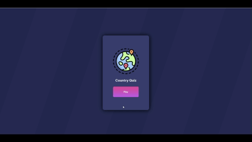

# 🌍 Country Quiz

A country quiz developed as part of the Devchallenges.io challenge. This app allows users to
test their knowledge of the capitals of independent countries.

## ## 🛠️ Technologies
* **React**: JavaScript library for the user interface.
* **HTML & CSS**: Structure and styles for the design.

## 💡 How to Use
1. Click the "Play" button to start the quiz.
2. Select the answer you think is correct for each question.
3. Navigate between questions by clicking on the numbers at the top.
4. Your progress is saved automatically.
5. After finishing all 10 questions, you'll see your final score. You can click "Play Again" button to start a new game.

## Author

**Jenn**